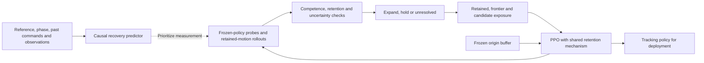

# LUCID: Recovery-Aware Curricula for Quality-Preserving Humanoid Robustness

**Common-controller update, September 7 UTC:** Released SONIC solves the four development motions. The common path-input migration now passes a versioned live same-state gate with zero action difference across 217,728 comparisons; both earlier cross-process gates remain failed. The protected four-motion PPO pilot completed all 128 iterations. Initial/final nominal and push evaluation is now running. See the [experiment ledger and limitations](lucid-common-path-input-status-2026-09-07.md) and [live W&B run](https://wandb.ai/16726/lucid-sonic/runs/wnb1cavy).

**Physical observability result, September 7 UTC:** The four-motion/three-phase physical-state experiment completed. All 6,144 horizontal translations changed measured task/critic displacement while active actor inputs, encoder outputs and action means remained exactly unchanged; instrument controls passed. The next step is a common path-error input, no-op validation and a bounded controller-repair pilot before multi-motion R1/curriculum training. See the [completed experiment](lucid-translation-observability-2026-09-07.md) and [common-input design](lucid-common-path-input-design-2026-09-07.md).

**Controller-foundation result, September 7, 03:14 UTC:** All eight released-controller cells completed: 100% completion and tracking qualification on all four development motions in both native and LUCID paths. The local origin/R1 had qualified on none of the three longer candidates. Select the released weights as the shared-origin candidate; validate tighter competence and horizontal recovery-error observability before multi-motion R1 continuation. See the [complete comparison, next-stage contract and evidence](lucid-shared-origin-contract-2026-09-07.md).

**Completed longer-motion screen, September 7, 01:57 UTC:** All eight cells finished. Both origin and R1 have 0% tracking-qualified execution on all three longer development motions. Curved walking and sideways walking largely survive but fail quality; stooping has 0% completion. The control passes retention (+8.79% global, -0.97% local). Establish a high-quality shared multi-motion origin before recovery calibration. The [current public page](https://linjiw.github.io/lucid/) reports all outcomes and the revised roadmap.

**New experiment, September 7, 01:25 UTC:** The eight-cell origin/R1 nominal multi-motion screen is executing in the simulator, with online W&B logging and automatic capacity gating between cells. It tests the original control plus three longer development motions. See the [frozen protocol and live-status paths](lucid-long-motion-screen-2026-09-07.md).

**Latest analysis, September 7, 01:06 UTC:** R1 remains the selected protected baseline from the completed 83-cell development screen. The four-cell contact diagnostic is complete. The separately preregistered eight-cell execution/retention parity campaign now passes all four pairs, covering 1,024 evaluation aliases and 380 aligned nonzero push events. Contact diagnostics remain unvalidated and the original all-metric gate remains failed. Recovery-band calibration and feedback efficacy are next. See the [research-direction update](lucid-research-direction-update-2026-09-07.md).

September 6, 2026. **Target paper and execution plan; proposed method claims are not results.** Incorporates the user's complete ideal-paper guidance. This document governs prospective research priorities; the completed retention screen retains its frozen endpoints, checkpoints, and stopping rules.

> Robustness should expand what the robot can execute faithfully—not merely what it can survive.

The operational question is whether a pretrained humanoid can learn to withstand more demanding dynamics and perturbations, recover the requested trajectory, and retain its original motion quality. Temporary recovery steps are permissible; persistent position, heading, and articulation errors are separately measured. The proposed title becomes a supported method title only after the recovery-feedback comparison succeeds. If it does not, retain the diagnostic paper, with failed repairs and comparisons visible.

## Current evidence and the gap to this paper

The complete 83-cell R0/R1/R2 screen supports one useful development result: R1 preserves empirical nominal/original-envelope quality at every sampled checkpoint and improves final held-out tracking qualification by 5.18 points over origin. This does not establish recovery feedback. The original all-metric recorder gate failed; a controlled contact-repeatability diagnosis motivates an explicitly versioned execution gate. [Retention results](lucid-retention-repair-results-2026-09-06.md) and [measurement/next-stage analysis](lucid-research-direction-update-2026-09-07.md) are the current evidence records.

| Candidate finding | Current warrant | Decisive missing evidence | Claim if it fails |
| --- | --- | --- | --- |
| Survival and faithful execution decouple | Existing single-origin SONIC continuation and frontier evaluations show retained completion with tracking drift; complete optimizer controls do not eliminate drift | Direct event-aligned translation, heading, articulation and later motion/origin replication | A bounded diagnosis; no universal causal account |
| History distinguishes recovery from persistent mismatch | Geometric components and offline recovery scorer pass analytical tests; current latent/history predictor has no recovery evidence | Causal event dataset, error/phase/motion-matched predictions, calibration, same-history strong baseline and information ablations | Direct error/history features suffice, or prediction is inconclusive |
| Retention and useful adaptation coexist | R1 passes empirical retention at all five sampled checkpoints and gains +5.18 held-out qualified points over origin | Additional learning seeds/origins and motions; uncertainty-aware retention and recovery-qualified outcomes | Bound the result to the observed development setting |
| Feedback adds value beyond protection and a fixed schedule | Not tested | Protected fixed vs frozen schedule vs quality/history/recovery feedback under one total budget, paired fresh origins | Attribute gains to the repair or schedule, not feedback |
| Recovery transfers beyond familiar push scripts | Offline measurement only; no final-policy transfer result | Unseen temporal process/combination tests, independent simulator, quantitative physical recovery | Bound conclusions to the tested simulator/process |

Historical optimizer, collapse, and exposure studies motivate the problem and belong mainly in supporting material. They must remain traceable and must not be rewritten as demonstrations of the proposed closed loop. See [current diagnostic roadmap](lucid-icra-roadmap-2026-09-06.md), [optimizer findings](lucid-optimizer-history-results-2026-09-06.md), and [startup repair](lucid-anchor-start-repair-2026-09-06.md).

## Problem, measurements, and information contract

Input is a solved motion-tracking policy pi0 with SONIC's unchanged actor/critic interfaces. A condition is c=(motion and phase, dynamics, disturbance process). The process includes direction, duration, location, occurrence phase, inter-event intervals, repeated events, and delay correlation—not only marginal severity. Output is a continued policy at a fixed total resource budget B.

The target is expected qualified execution on a **predeclared evaluation distribution**. Its weights are stress-test design choices, not estimates of real-world occurrence probabilities. Each qualified episode must complete the reference, meet tracking requirements, satisfy the predeclared recovery requirement for its eligible perturbations, and avoid failures of explicitly validated constraints. Until physical safety channels are validated, call the endpoint tracking-and-recovery-qualified execution; do not silently imply a safety certificate. Nominal episodes have no perturbation-recovery requirement, but retain their tracking and completion requirements.

Report pelvis/world translation, wrapped heading, translation-only root-relative pose, heading-aligned articulation, and legacy global MPJPE. They are **not additive scalar components**. Fix the initial reference/world alignment once; no frame-by-frame trajectory alignment may remove displacement. Phase is reference phase, not a fitted phase warp selected to improve a score. The current local metric is not automatically articulation with heading removed. Legacy means and newly measured event/first-episode metrics stay in separately named columns.

For every retained motion m and designated component k, require E_mk(pi)-E_mk(pi0)<=delta_mk and a separate completion-loss constraint. A pooled improvement cannot compensate for a failed retained motion. The current +10% error and −2 percentage-point completion limits remain frozen development rules; final task tolerances require a new predeclared, measurement-supported specification. Near-zero origin error requires an absolute tolerance decision, not division by zero. All designated constraints must pass jointly; report uncertainty at the decision-family level.

Recovery starts after an actual perturbation, requires all designated phase-dependent components inside their bands for a fixed dwell, and is graded with residual error at the horizon. Report non-recovery, termination, missing observations and overlapping-event censoring separately. Conditional recovery-time medians never replace the all-event denominator. Bad pre-event tracking stays visible and is not attributed to the new push. The current isolated-event scorer censors overlaps conservatively; double-push tests need their own pair/episode endpoint. Do not reuse the isolated scorer to make a repeated-recovery claim.

| Information | Recovery predictor / direct baselines | Labels and evaluation only |
| --- | --- | --- |
| Reference motion, phase, declared reference preview | Allowed and identical across matched predictors | Full reference can define target error |
| Commands actually sent before the prediction time | Allowed; distinguish policy raw action from post-delay/scaled actuator command | Audit action scaling and delay correspondence |
| Observations/history available by prediction time | Allowed; causal history only | Independent external position measurement on hardware |
| Future executed motion, termination, achieved recovery, actual future pushes | Forbidden | Define outcomes after the prediction time |
| Simulator privileged states and known disturbance realization | Excluded from the proposed deployable-input predictor unless explicitly disclosed as a training-only alternative | Label construction and event truth |

Split complete episodes, source motions and origins before generating overlapping windows. Training-only preprocessing and threshold calibration; no shared windows across folds. The observer initially remains training-side: the policy receives no new latent. Whether a deployment monitor transfers is a separate test.

## Gate sequence and next concrete actions

| Gate | Work and comparison | Pass condition / response to failure |
| --- | --- | --- |
| G0: useful retention repair | Complete: R1 selected; R0/R2 fail retention | Empirical one-origin gate passed; keep the frozen endpoint and limits; independent confirmation remains pending |
| G1: trustworthy recovery data | Validate event-seam capture, reset identity, timestamps, body/quaternion order; paired recorder-on/off frozen-policy simulator test | Identical actions, motion/termination outcomes and RNG progression, valid event traces; quantify logging overhead. Then collect dedicated origin calibration rollouts and freeze bands/dwell/horizon |
| G2: incremental predictive information | Compare instantaneous components, derivatives, simple history, strong same-history predictor, compact reference/action/history model | Improvement with uncertainty on held-out whole episodes/motions/origins and error-matched subsets; acceptable calibration and lead time. If simple features tie, use them; do not insist on a latent |
| G3: affordable, calibrated decisions | Freeze finite looks/attempts, real sampling units, quality estimands and candidate practice budget; calibrate fresh simulator draws | False admission/hold, unresolved rate and full cost measured prospectively. Raw MPJPE bounds cannot be inferred from observed maxima |
| G4: feedback changes useful learning | Shared repair; protected fixed vs frozen schedule vs direct/history/recovery feedback; fresh origin branches | Prespecified primary endpoint improves at the same total resource limit while every retention constraint passes. Do not replace endpoint by cost-to-target after seeing a loss |
| G5: broaden and transfer | Shared multi-motion policy, fresh origins, unseen temporal/combined conditions, independent simulator, then hardware protocol | State only completed evidence tiers. Failure narrows the claim rather than deleting a condition |

G1 now has live execution evidence plus a contact-repeatability limitation. Version two passed exact recorded execution and non-contact-derived evaluation metrics across all four pairs on new development seeds; it reports all contact metrics separately and does not reclassify the failed original test. Next validate nonzero push alignment and usable post-event windows, then freeze origin-only calibration and validation rules. No utility estimator or residual allocator is introduced.

**Implementation advance:** [native event/trajectory capture and paired audits](lucid-native-recovery-capture-status-2026-09-06.md) are implemented. Four nominal contact-diagnostic repeats completed at source `877bac8`; the new eight-cell execution-gate campaign at `84dfd53` completed with all four pairs passing and is logged online. The [versioned amendment and complete diagnosis](lucid-research-direction-update-2026-09-07.md) preserve the old failure and separate execution evidence from contact sensing. Neither experiment supplies recovery labels.

The intended loop below is conceptual; learned recovery prediction and feedback benefit remain unverified.

## Recovery prediction experiment card

Question: among states with comparable current error, reference motion/type and phase, does command-conditioned history distinguish subsequent return from persistent mismatch?

Models: (a) current component errors; (b) errors plus finite-difference trends; (c) raw command/execution mismatch; (d) simple history statistics; (e) a strong predictor on the **same complete history inputs** as (f) the compact proposed encoder. Include shuffled order, removed past commands, and removed reference conditioning with matched training/tuning budgets. Do not call (e) weaker merely because it is not branded LUCID.

Outcome: future recovery by a fixed horizon, plus persistent mismatch. Freeze termination/overlap/missing-data treatment and the predictive sampling time before training. Distinguish prediction of return from prediction of survival. Report AUROC and AUPRC with class prevalence, Brier score/log loss, reliability curves, sensitivity at a development-frozen episode-level false-alarm rate, and lead time with missed detections retained. Report both population and matched-subset results; matching changes the evaluated population. Use shared splits and paired uncertainty, clustered at least by full episode and origin. Accuracy on sampled windows is not an independent-policy denominator.

Promotion requires both an offline gain and later closed-loop benefit when each signal drives the **same scheduler**. Observational matching is diagnostic evidence, not proof that a hidden recovery state causes the gain. A learned representation earns its cost only if the stronger direct/same-history baselines cannot explain it.

## Curriculum and retention contract

Three exposure components share one total training budget: retained conditions, admitted frontier, and bounded candidate practice. Select mixture proportions on development data and freeze them before confirmation. Record realized environment transitions, event counts, severity, direction, phase and combinations; support ranges alone do not establish exposure.

Reference-action anchoring uses only the origin's eligible retained-state buffer. Preserve the distinction between this action-mean squared penalty and a policy KL involving learned variance. Do not force imitation of origin failures at the hard frontier. Every protected baseline receives the same retention mechanism, buffer and tuning allowance. Stopping expansion leaves both retention training and admitted-condition practice active.

Expand only when candidate competence and **every** retention constraint have supported passing evidence. Hold for supported competence or quality failure. Otherwise sample the next finite increment; unresolved at the cap remains unresolved and receives only the preallocated candidate practice. Do not turn insufficient evidence into failure, expansion, or unlimited probing. Confidence spending covers all looks, endpoints, candidates and adaptation attempts, with actual sampling dependence addressed. Model predictions may prioritize measurement; admission still rests on observed outcomes. Channel admission does not imply joint-condition admission.

## Study size, baselines and resource ledger

The proposed 24 training / 8 development / 16 test source-motion split and five independent solved origins are the **target scale**, pending inventory, origin competence and measured cost. Source clips, hashes and lineage are frozen before selection. Report “excluded from LUCID adaptation/tuning” unless base-model pretraining absence is verifiable. One shared policy must execute the entire panel; per-motion specialists are a separate study. Seeds 8600–8602 have influenced development and do not become untouched confirmation origins by renaming them.

Target main methods: tuned Fixed DR; protected Fixed DR; protected frozen schedule; protected quality/success-constrained ADR; protected history curriculum; complete LUCID. Five independent origins branched into six methods give 30 continuations. The frozen origins are evaluated references, not a seventh trained method. Match architecture, optimizer family/continuation contract, allowed condition set, motion inputs, and development-selection resources; disclose any necessary baseline adaptation to SONIC.

A 12-condition × 16-motion × 128-rollout panel gives 24,576 rollouts per policy. Thirty trained policies imply **737,280** endpoint rollouts; five origin references add **122,880**, for **860,160** before intermediate checkpoints, development evaluation, observer training, probe calibration, additional looks or transfer. This is a major cost decision, not an automatic queue. Estimate precision and wall time using the development pilot first. No fabricated motion assignments or automatic 30-run launch is implied.

The 2×2 attribution study (fixed/feedback × without/with retention) may reuse exactly matching registered main arms. Its feedback-without-retention arm is additional if absent from the six-method grid; do not hide it in the count. Signal substitutions, frozen schedule transfer, exposure-order shuffles, probe-size comparisons and temporal-shift tests also need explicit extra resource entries.

Use origin-paired effects, motion-level distributions and hierarchical uncertainty with the origin as the independent learned-policy unit. Thousands of rollouts reduce within-policy uncertainty but do not create thousands of learning replications. Five origins do not guarantee power for a 5-point difference. Final effect and precision targets follow prospective variance/cost analysis; the suggested +5 percentage points remains a practical design target, not a predicted result or universal acceptance threshold.

Primary comparison is final held-out qualified execution subject to retained-quality constraints at fixed B. Report the quality–robustness trajectories and full feasible/infeasible outcomes. Cost-to-target is secondary, with its target frozen before confirmation. B includes training/probing transitions, observer fitting and inference, anchor collection/sample presentations/forwards, combined backward cost, failed starts, checkpoint evaluation and actual wall/GPU time. Separate shared development costs from recurring per-origin costs; do not invent a compute-equivalent exchange rate from PPO iteration counts alone.

## Transfer and hardware tier

First verify final exports, observations, history, action/latency semantics, timestep and frames in the independent simulator. Stress axes include unseen direction/phase, inter-event interval, repeated pushes, same delay marginal with changed temporal correlation, and predeclared combinations. Increasing one velocity multiplier is not the entire transfer experiment.

The user's complete hardware target is retained: four short motion families (forward locomotion; lateral/backward; turning/start-stop; whole-body weight shift), two common smooth 45–60-second sequences, and nominal / lower impulse / higher impulse / measured material plus lower impulse conditions. Four methods (origin, strongest protected fixed, strongest development-selected non-LUCID curriculum, LUCID), three independently trained checkpoints per method, same checkpoint across motions. Freeze checkpoints and motions before hardware scores.

The proposed counts are 768 short episodes + 96 long episodes + 96 feedback-signal ablation episodes = **960**. If full-LUCID ablation cells reuse identical registered main trials, they are not 48 new independent trials: the additional collection would instead be 48 and the total 912. Decide reuse versus fresh collection beforehand; do not double-count repeated data. Counts alone confer no precision guarantee. Randomize/counterbalance method order within motion/condition/session, preserve battery/thermal/material context, and report attempted, interrupted and unexecuted trials separately. Never choose best checkpoints per motion after testing.

Measure force-versus-time, application position/direction, duration, and impulse in physical units; simulator velocity increments are not N·s. Use independent external position truth and fixed initial alignment. Report recovery fraction, non-recovery, residual translation/heading/articulation, nominal retention and secondary measured/proxy effort separately. Session and checkpoint clustering remain explicit. Apparatus, operator, verified protection and stopping rules, and deployment checks must be ready before physical tests. This plan does not launch hardware.

## Paper package

Introduction: a robustified humanoid remains upright but leaves its reference trajectory. Explain the need to allow temporary recovery while limiting lasting mismatch. Problem: qualified execution, retained ability, condition/process and resource budget. Method: causal recovery observations, common retention mechanism, evidence-based allocation. Results: main tradeoff first, then signal value, 2×2 attribution, feedback vs transferred schedule, probe cost and transfer. Discussion: where fixed training suffices and which motion/process failures remain.

Six figure slots: (1) measured failure/recovery examples; (2) training-side closed loop with deployment boundary; (3) origin-relative quality vs qualified robustness with temporal trajectories; (4) matched-current-error states with different futures and calibrated predictions; (5) decision trajectories, realized exposure and full cost on fresh origins; (6) hardware frames synchronized with component errors. A conceptual illustration must be labeled conceptual until actual outcomes exist.

Abstract scaffold: “Robustness training can improve humanoid survival while degrading faithful motion tracking. We study quality-constrained robustness expansion of pretrained tracking policies. [After G2–G4: describe the verified recovery feedback, retention mechanism and allocation rule.] On [verified motions/origins/processes], [method] changes held-out qualified execution by [paired effect and interval] relative to [strongest protected baseline], at [resource budget], while [per-motion retention result]. [After G5: state the actual independent-simulator/hardware outcome and denominator.]” Do not fill result slots from desired findings or smoke losses.

## Primary-source audit and novelty boundary

- [SONIC project and paper](https://nvlabs.github.io/GEAR-SONIC/): motion tracking is the inherited whole-body control interface. Our proposed change is training allocation/retention, not a newly invented base controller.
- [RAPT v2, Sections 3–5](https://arxiv.org/html/2602.01515v2): calibrated recurrent predictive-deviation monitoring and diagnosis already exist. Recovery-label prediction and its causal value for curriculum decisions require separate evidence.
- [PPF, Section V](https://arxiv.org/html/2504.09833v2): expert-action regularization and relaxing it when the expert's model assumptions fail are established. Our eligible solved-origin buffer differs, but anchoring alone is not sufficient novelty.
- [DORAEMON, Sections 4 and 6](https://arxiv.org/html/2311.01885v2): success-constrained randomization growth is established; its discussion proposes a policy KL constraint against forgetting. “Stricter success” alone does not separate this work.
- [TransCurriculum v1](https://arxiv.org/html/2603.14156v1): history-aware multidimensional curriculum is established. Compare the information and decisions contributed by reference/action-conditioned recovery, with faithful adaptation of baselines documented.
- [Howard et al.](https://arxiv.org/abs/1810.08240): sequential uncertainty requires a valid sampling/coverage construction. Our finite-look prototype is not a new statistical theorem.
- [Agarwal et al.](https://arxiv.org/abs/2108.13264): use reliable small-run evaluation and uncertainty; episode replication does not substitute for independent training.
- [NVIDIA's G1 workflow guidance](https://docs.nvidia.com/learning/physical-ai/gr00t-e2e-workflow/latest/real-robot-workflow/g1-introduction-and-safety.html): its software safety controller is explicitly not equivalent to an independent emergency stop. Applicability must be checked for the actual deployment configuration; this is not a hardware authorization.

The defensible prospective contribution is the **measured incremental value of recovery information for quality-preserving training decisions**, including its computational cost and limitations. None of the cited sources proves that LUCID will achieve it.

Earlier runtime snapshots are historical; use the current evidence and experiment status linked above.
