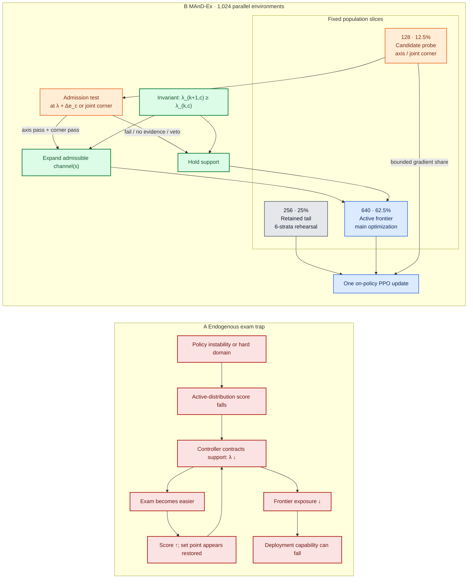

# MAnD-Ex: Monotone Anisotropic Domain Expansion for Humanoid Control

**Anonymous authors**

**Working manuscript:** 2026-09-02 11:25:43 EDT

**Revised after structural review:** 2026-09-02 13:06:57 EDT

> **Draft-integrity note (remove before submission).** Results labeled **Measured** are
> backed by completed project artifacts. Results labeled **Pending** specify experiments
> that have not completed. In particular, the decisive Claim-B matched-ramp comparison,
> MuJoCo transfer, and Unitree G1 evaluation are pending and must not be converted into
> positive claims without data.

## Abstract

Curriculum learning in robotics operates under a silent hazard: when an adaptive
scheduler measures competence on the very distribution it is authorized to contract, it
can maximize its feedback metric by trivializing the environment—a pathology we define
as **difficulty evacuation**. In 8,000-iteration humanoid motion-tracking runs, a
representative bidirectional scalar curriculum reduced difficulty in all six
seeds/variants tested and terminally evacuated it in two, ending at normalized support
widths 0.062 and 0.012. The apparent improvement is striking: evacuated arms average
14.84 terminal return versus 11.60 for support-holding arms, yet their held-out frontier
AUC is lower (0.719 versus 0.833), and one predeclared collapse loses 14.19 success-AUC
points relative to fixed domain randomization on the same seed. High training return can
therefore conceal the removal of the physics needed at deployment.

We introduce **MAnD-Ex**, Monotone Anisotropic Domain Expansion, a curriculum contract
with three invariants. First, support is non-contracting: every physical frontier may
expand or hold, but never retreat. Second, readiness is measured by a dedicated
candidate cohort at the proposed next support, not by performance on the current
distribution. Third, frontiers are channel-wise; the full interaction-protection
extension adds a joint-corner sentinel that can veto individually admissible steps when
they fail in combination. The sentinel is specified here but remains pending
implementation and ablation. The training population retains 25% of samples across
earlier support, places 62.5% at the active frontier, and reserves 12.5% for candidate
probes.

The evidence supports two deliberately separate claims. **Claim A, mechanism
inoculation, is measured:** a scalar monotone projection refused 2,033 retreat requests
across three seeds with zero contractions. Under the frozen component-wise rule, all four
success/progress AUC checks stayed within their seed-wise margins—2 points at the frontier
and 1 point in-envelope—in all three paired seeds. Frontier success averages $+0.60$
points ($N=3$, sample SD $2.25$; two seeds slightly favor fixed DR), supporting
noninferiority, not superiority. A candidate survival gate then expanded support from 1.0× to
1.5× in four evidence-triggered steps without retreat. A 55-cell sweep further reveals a
policy-dependent anisotropic failure surface and a joint 2× loss about six success points
beyond the sum of measured marginal losses. **Claim B, curriculum efficacy, remains
pending:** MAnD-Ex must beat an
exact-support open-loop ramp under matched compute, mixtures, and final bounds. A tie
would reject an online-timing advantage but would not invalidate Claim A: monotonicity
still removes the scheduler's contraction pathway, with no contraction-gain or decay
schedule to tune. We next specify frozen MuJoCo and Unitree G1 tests through the same
C++/TensorRT deployment path using quality-qualified success, foot slip, actuator work,
latency, and safety-tether outcomes.

## 1. Introduction

Domain randomization (DR) is a standard tool for transferring robot policies from
simulation to hardware. Instead of optimizing against one simulator, a policy trains on
a distribution of masses, inertias, friction coefficients, center-of-mass locations,
sensor and actuator characteristics, delays, and external disturbances [1–4]. The hope
is simple: if the deployment system lies within—or near—the training distribution, the
policy will remain functional when the nominal model is wrong.

The width and shape of that distribution matter. Applying large perturbations too early
can prevent learning, while a narrow fixed distribution can leave the policy brittle.
Adaptive DR and self-paced curricula address this tension by changing the training
distribution as the policy improves [5–9]. Yet a broad class of these methods contains a
control-theoretic vulnerability that is easy to overlook.

Suppose a scheduler observes return, survival, tracking error, or a learned mismatch
statistic on its current training distribution. When the score becomes poor, it is
allowed to reduce randomization. The next batch is easier, so the score improves—even if
the policy has not acquired any additional capability. The scheduler has changed the
exam it uses to grade itself. Repetition can drive the training distribution away from
the deployment frontier while standard training dashboards look healthier.

We call this **the endogenous exam trap**, and its terminal behavior **difficulty
evacuation**. It is not tied to a particular encoder, controller gain, robot, or reward.
It arises whenever three ingredients coincide:

1. the curriculum controls the distribution on which its signal is measured;
2. lowering difficulty improves that signal; and
3. the actuator is permitted to contract support.

The problem is particularly serious in humanoid control. A policy may preserve aggregate
return by seeing fewer destabilizing dynamics, yet lose the exposure needed to survive
pushes, contact transitions, or timing mismatch. Moreover, humanoid robustness is not a
single scalar. A controller can be tolerant to mass and joint offsets but fragile to
pushes; another can fail first under center-of-mass shift. Scaling all channels with one
number either over-trains easy axes or drags a bottleneck forward with them. Independent
axes do not solve the whole problem because combined perturbations can fail
super-additively.

MAnD-Ex treats curriculum design as an actuator-admissibility problem rather than a
hyperparameter-recovery problem. Once a scheduler both chooses the exam and reads its
score, correctness must begin with constraints on what the actuator is allowed to do.
MAnD-Ex therefore uses structural invariants rather than a more elaborate score
predictor. It represents the learned DR support as a box with a frontier for each physical
channel. Support cannot contract. A population-scale probe tests one candidate step
beyond the active frontier, channel by channel. A joint-corner sentinel periodically
tests whether individually admissible expansions remain safe in combination. Earlier
support is retained as an explicit rehearsal tail. This separates the question “Can the
policy absorb the candidate domain?” from “How well is the policy doing on the domain it
already chose?”

This paper separates two questions that an adaptive-curriculum result can otherwise
blur. **Claim A asks whether the architecture is inoculated against difficulty
evacuation.** It is a mechanism and auditability claim: the controller cannot apply a
retreat, and its observed score cannot be repaired through contraction. The primary
receipt is 2,033 refused retreat requests with zero applied decreases; the three-seed AUC
comparison supports noninferiority only. **Claim B asks
whether candidate-dependent timing trains a better policy than a matched open-loop
ramp.** It is an empirical efficacy claim requiring the pending five-seed comparison.
Even if Claim B is a tie, Claim A remains useful in safety-critical training: MAnD-Ex has
a strictly stronger support-retention guarantee than a bidirectional controller and
requires no tuned contraction path. This statement concerns operational invariants, not
an unmeasured guarantee of higher task performance.

The experimental logic is equally structural. A feedback curriculum is not credited for
merely reaching wide support. It must outperform an open-loop ramp with identical compute,
strata, terminal bounds, and training mixture. Isaac Lab establishes training dynamics
and held-out physics capability. MuJoCo then tests a frozen exported policy through the
same deployment path used on hardware, including realistic delay processes. Only a clean
and robust sim2sim result unlocks a randomized, safety-gated Unitree G1 study.

### 1.1 Contributions

This paper makes four contributions:

1. **A general failure mode.** We formalize the endogenous exam trap and measure
   difficulty evacuation in long-horizon humanoid RL, including the inversion between
   terminal training return and held-out frontier capability.
2. **A standalone curriculum method.** MAnD-Ex combines non-contracting support,
   candidate-level population probes, channel-wise frontiers, and retained rehearsal,
   and specifies a joint-corner interaction-protection extension.
3. **Mechanism evidence for the design.** We demonstrate zero-contraction inoculation,
   fixed-DR noninferiority, candidate-gated expansion, policy-dependent anisotropy, and
   super-additive joint failure in SONIC whole-body tracking; we do not claim performance
   superiority from the three-seed monotone ablation.
4. **A deployment-facing evaluation.** We define a matched-ramp test followed by frozen
   Isaac→MuJoCo→Unitree G1 validation using motion-family outcomes and independent
   measures of slip, work, smoothness, latency, and safety intervention.

### 1.2 Claim structure

The paper's conclusions are intentionally conditional:

- **Claim A—Pathology inoculation (measured):** non-contraction removes difficulty
  evacuation as an available controller action. Across $N=3$ seeds, 2,033 retreat
  requests produce zero applied decreases. All four AUC components pass their frozen
  seed-wise rule using 2-point frontier and 1-point in-envelope margins; the frontier-
  success mean is $+0.60$ points (sample SD $2.25$), but two seeds favor fixed DR
  slightly and superiority is not claimed.
- **Claim B—Curriculum efficacy (pending):** candidate-gated anisotropic timing improves
  held-out capability or restricted-mean progress relative to Baseline-Ramp-Asym with the
  same final support and budget.
- **Downstream value (pending):** a frozen MAnD-Ex policy retains any Tier-1 benefit in
  MuJoCo and then on a Unitree G1 without degrading physical quality or safety.

Failure of a later claim narrows the paper at that boundary; it does not rewrite an
earlier measured result.

### 1.3 Figure 1: pathology and architectural contract



**Figure 1.** Vector source for the camera-ready concept figure. Left: the self-reinforcing
evacuation loop, $\lambda\downarrow\rightarrow\text{score}\uparrow\rightarrow$ apparent
controller satisfaction, despite declining frontier exposure. Right: the exact 1,024-
environment population partition. Gray retained-tail environments rehearse six prior
strata, blue frontier environments provide the main gradient volume, and orange candidate
environments both train and supply pre-update admission evidence. Axis probes estimate
marginal capacity; the joint corner can veto a commit; neither path can contract support.
The final paper should render this source to SVG/PDF with color-blind-safe equivalents and
retain distinct hatching for grayscale print.

## 2. Related Work

### 2.1 Humanoid motion tracking and transfer

DeepMimic, adversarial motion priors, BeyondMimic, and SONIC illustrate the rapid growth
of reference-conditioned humanoid control [10–13]. These systems learn high-dimensional,
contact-rich behaviors in simulation and increasingly expose deployment stacks for
physical humanoids. Their transfer remains sensitive to contact modeling, inertial
properties, actuator response, observation semantics, and latency.

We use SONIC as the sole claim-bearing testbed. It provides a 29-DoF Unitree G1 model,
a universal-token controller running at 50 Hz, continued-training checkpoints, Isaac Lab
training, MuJoCo mappings, and a C++/TensorRT deployment stack [12]. A separate
BeyondMimic checkout is useful for development but is excluded from claim-bearing tables.

### 2.2 Fixed, adaptive, and self-paced domain randomization

Fixed DR samples a hand-specified distribution throughout training [1–4]. Canonical
Automatic Domain Randomization expands parameter boundaries after performance at those
boundaries passes a threshold [5]. Active and entropy-maximizing DR methods optimize
which domains to sample [6,7], while self-paced and teacher-based curricula trade task
difficulty against learning progress [8,9]. Prioritized level replay and related
environment-design methods emphasize informative levels rather than uniform exposure
[14,15].

MAnD-Ex is not a renaming of canonical ADR. Canonical ADR already motivates monotone
boundary expansion; our focus is the full contract needed for high-dimensional humanoid
physics: a retained on-policy support mixture, population evidence at a *future* domain,
policy-specific vector frontiers, explicit interaction veto through joint-corner probes,
support-stated endpoints, and an exact-support matched ramp. These components target the
failure modes exposed when a scalar or bidirectional controller is applied to coupled
contact dynamics.

### 2.3 Delay-aware robot learning

Random-delay training can improve robustness, but “delay” is not one parameter [16]. A
maximum of 60 ms can describe a common transport lag, independent actuator-group lags,
episode-static offsets, interval jitter, or rare bursts. These processes yield different
closed-loop dynamics. We therefore model latency by amplitude, coupling, cadence, and
burst probability, and carry the same realized process from Isaac Lab into MuJoCo and
hardware logging.

### 2.4 Evaluation beyond reward

Episodic return depends on the active training distribution and may reward conservative
or oscillatory behavior. Smoothness and high-frequency action content matter for physical
control even when task completion remains high [17]. Our primary deployment endpoint is
quality-qualified success: completion must coincide with acceptable tracking, slip,
contact, actuator saturation, and safety-tether behavior. Metrics are masked at first
termination so early failure cannot appear artificially accurate.

## 3. The Endogenous Exam Pathology

### 3.1 Setup

Consider a policy $\pi_\theta$ trained on motions $m$ and physical parameters $\phi$.
Let $P_{\boldsymbol\lambda}(\phi)$ be a DR distribution indexed by channel-wise frontier

$$
\boldsymbol\lambda=(\lambda_1,\ldots,\lambda_C),
$$

where $C$ includes joint-default offset, center-of-mass offset, contact material, push,
action delay, and rigid-body mass. A scalar curriculum is the constrained case
$\lambda_1=\cdots=\lambda_C$.

At iteration $k$, an adaptive scheduler observes statistic $Y_k$ on samples from
$P_{\boldsymbol\lambda_k}$ and applies

$$
\boldsymbol\lambda_{k+1}=F(\boldsymbol\lambda_k,Y_k).
$$

The actual target is a frozen deployment objective

$$
J(\theta)=\mathbb E_{(m,\phi)\sim Q_{\mathrm{test}}}
\left[\operatorname{QSuccess}(\pi_\theta;m,\phi)\right],
$$

where $Q_{\mathrm{test}}$ is not controlled by the scheduler.

### 3.2 Evacuation condition

Write the population score as

$$
\bar Y(\theta,\boldsymbol\lambda)
=\mathbb E_{\phi\sim P_{\boldsymbol\lambda}}[Y(\pi_\theta;\phi)],
$$

and assume higher $Y$ is interpreted as greater competence. In a locally active channel
$c$, wider support lowers the score when

$$
\frac{\partial \bar Y}{\partial \lambda_c}\le -g_c<0.
$$

Suppose a learning transient changes the policy by $\Delta\theta_k$ and depresses its
score below the scheduler set point,

$$
\Delta\theta_k\ \text{transiently destabilizes learning}
\quad\Longrightarrow\quad
\bar Y(\theta_k,\boldsymbol\lambda_k)-Y^*\le -\varepsilon<0.
$$

A common integral actuator obeys

$$
\dot\lambda_c=K_c\big(\bar Y-Y^*\big),\qquad K_c>0,
$$

so a sustained deficit gives $\dot\lambda_c\le-K_c\varepsilon<0$. Before any improvement
in $\theta$, the resulting support change raises the measured score to first order:

$$
\mathrm d\bar Y\big|_{\theta}
=\frac{\partial\bar Y}{\partial\lambda_c}\,\mathrm d\lambda_c>0,
$$

because both factors are negative. Under a persistent deficit, the lower rail is reached
in at most $(\lambda_{0,c}-\lambda_c^{\min})/(K_c\varepsilon)$ units of continuous
controller time. The shortcut dominates when policy adaptation on the hard dynamics is
slower than the scheduler actuator,

$$
\left|\nabla_\theta\bar Y\cdot\dot\theta\right|
\ll K_c\left|\bar Y-Y^*\right|.
$$

This time-scale separation makes contraction of $\lambda_c$, rather than optimization of
$\theta$, the fast response of the coupled system $(\theta,\boldsymbol\lambda)$. The same
direction arises if the scheduler explicitly minimizes the set-point loss

$$
V(\boldsymbol\lambda)=\frac12\big(\bar Y-Y^*\big)^2,
\qquad
\dot\lambda_c=-\eta\frac{\partial V}{\partial\lambda_c}
=-\eta(\bar Y-Y^*)\frac{\partial\bar Y}{\partial\lambda_c}<0.
$$

Thus, under the stated local bounds, contraction is the direct path for restoring the
feedback target: the controller can raise $Y$ by changing $P$, not $\theta$. This is a
conditional mechanism result, not a claim that every bidirectional curriculum must
collapse; deadbands, saturation, recovery of the policy, or exogenous evaluation can
interrupt the trajectory. Within the stated regime, however, changing $K_c$ tunes the
speed of evacuation rather than its direction. The failure is therefore a structural
feedback degeneracy, not merely an unlucky gain choice.

This is distinct from ordinary curriculum forgetting. Forgetting says later training may
damage earlier capability. Difficulty evacuation says the scheduler actively removes the
domains that reveal damage and then grades itself on the easier replacement.

### 3.3 Signal–actuator admissibility

A readiness signal cannot be judged independently of its actuator and measurement
location. We use six tests:

1. **Competence anchoring:** the signal changes consistently as the policy learns while
   difficulty is fixed.
2. **Actuator authority:** candidate difficulty moves the signal in a nontrivial,
   correctly signed direction.
3. **Population coverage:** evidence represents the cohort whose support decision is
   being made.
4. **Bounded meaning:** a threshold retains interpretable scale through training.
5. **Candidate location:** evidence is collected at the proposed next support.
6. **Non-invertible action:** failure to pass causes a hold, never a contraction.

Time-out survival is bounded, population-wide, and strongly competence-anchored in our
testbed. It is still unsafe on the active distribution: a controller can improve survival
by making episodes easier. MAnD-Ex makes survival admissible by moving measurement to a
candidate cohort and removing contraction from the action space.

> **Curriculum-actuator axiom.** A failed competence test may deny a proposed expansion;
> it may not erase support that has already been admitted.

## 4. MAnD-Ex

> **MAnD-Ex architectural contract.** The method is defined by three invariants, not by
> a particular readiness threshold or controller gain:
>
> 1. **Monotonicity invariant:**
>    $\forall k,c:\ \lambda_{k+1,c}\ge\lambda_{k,c}$.
> 2. **Counterfactual-probe invariant:** an axis admission decision uses evidence at
>    $\boldsymbol\lambda_k+\Delta_c\mathbf e_c$, never competence measured only at
>    $\boldsymbol\lambda_k$.
> 3. **Orthogonalized anisotropy and interaction veto:** axis probes estimate marginal
>    capacity; a joint-corner sentinel can veto a multi-axis commit whose combined
>    survival violates the preregistered floor.
>
> A pass may expand support and a failure may hold it. Neither outcome can retreat.

### 4.1 Box-shaped support

For channel $c$, $\lambda_c=1$ denotes the nominal training envelope and
$\lambda_c>1$ extrapolates its configured deviations, subject to physical constraints
such as nonnegative friction and valid mass ratios. The support is the product

$$
\mathcal S(\boldsymbol\lambda)=
\mathcal S_1(\lambda_1)\times\cdots\times\mathcal S_C(\lambda_C).
$$

Each channel has an immutable ceiling $\lambda_c^{\max}$. Ceilings may differ because
the policy’s absorbed capacity is anisotropic. All commanded and realized ranges are
recorded; a scalar label alone is insufficient once physical clipping occurs.

### 4.2 Retained-tail, frontier, and candidate cohorts

At 1,024 environments, MAnD-Ex uses eight fixed cohorts:

- **retained tail:** 256 environments distributed across six prior-support strata;
- **active frontier:** 640 environments at $\boldsymbol\lambda_k$; and
- **candidate cohort:** 128 environments at the active probe.

Thus 25% of training rehearses earlier support, 62.5% concentrates learning at the
frontier, and 12.5% supplies statistically useful candidate evidence. The candidate
cohort **does contribute policy gradients** in the present design. At iteration $k$, the
effective on-policy mixture is

$$
P_{\mathrm{train},k}
=0.25P_{\mathrm{tail},k}
+0.625P_{\boldsymbol\lambda_k}
+0.125P_{\boldsymbol\lambda_k^{\mathrm{probe}}},
$$

and the PPO gradient is

$$
\nabla_\theta\mathcal L_{\mathrm{PPO}}
=\mathbb E_{\phi\sim P_{\mathrm{train},k}}
\left[\nabla_\theta\ell(\pi_\theta;\phi)\right].
$$

The heterogeneous mixture can increase value-error and GAE variance, so observation
conditioning must be explicit. In the evaluated SONIC configuration, the actor receives
a ten-step causal history of gravity direction, base angular velocity, joint positions,
joint velocities, and previous actions through its policy observation stream. The
asymmetric critic is a separate MLP over privileged observations: it receives ten-step
histories of base linear/angular velocity, joint positions/velocities, and actions, plus
the reference command and body pose/orientation terms. Neither network is handed the
randomization vector $\phi$ directly. These histories and realized-state features let the
critic condition its baseline on the dynamic regime expressed in the trajectory, but they
do not guarantee equal value accuracy across cohorts. The pending Claim-B campaign will
therefore report value loss, explained variance, and GAE standard deviation separately
for tail, frontier, and probe slices. A cohort-conditioned or stratified critic is
introduced only in a separately labeled ablation if that audit shows a material cohort-
dependent residual; it is not silently added to MAnD-Ex.

The temporal contract has four ordered phases:

1. **Rollout:** collect all step data across the 1,024 environments under the single
   behavior policy $\pi_{\theta_k}$.
2. **Attribution:** compute termination cause and time-limit survival strictly from the
   128 fixed probe identities; no tail or frontier episode enters the gate statistic.
3. **Gating:** decide pass, hold, or corner veto and write
   $\boldsymbol\lambda_{k+1}$ for subsequent environment resets only.
4. **Parameter update:** compute PPO over all rollout slices with weights
   $0.25/0.625/0.125$ and update $\theta_k\rightarrow\theta_{k+1}$.

No support decision retroactively changes the distribution label of a collected rollout,
and no post-update outcome is credited to the pre-update policy. Episodes already in
flight retain the physical parameters sampled at their reset; a decision at iteration
$k$ changes only future reset events carrying the new support-version identifier. This
**reset-isolation principle** forbids mid-episode range changes and makes the attribution
boundary auditable. MAnD-Ex therefore uses a
**forward-shifted training mixture with pre-update behavioral attribution**. The probe is
counterfactual in domain location—it tests the proposed next support—but it is not an
unbiased, zero-gradient OOD evaluator. Its anticipatory optimization mass is capped at
12.5%, its identity is fixed, and every matched control uses the same cohort fraction and
gradient budget. **MAnD-Ex-Probe-NoGrad** is the isolating ablation: it separates decision
evidence from gradient nourishment by allowing its 128 environments to affect the gate
but not $\nabla_\theta\mathcal L_{\mathrm{PPO}}$. Fixed cohort identities make both
evidence and gradient exposure auditable.

The no-gradient arm is diagnostic rather than the decisive efficacy baseline because one
cannot simultaneously hold both collected simulator transitions and unique PPO samples
fixed after withholding 12.5% of rollouts. We therefore report two budgets explicitly:
total environment transitions, including probes, and transitions admitted to PPO. The
main MAnD-Ex-versus-ramp comparison avoids this ambiguity by giving both methods the same
gradient-bearing 25/62.5/12.5 mixture; the no-gradient result is used only to attribute
whether probe exposure itself contributes to any observed gain.

The retained tail distinguishes support expansion from support replacement. Earlier
domains never disappear merely because a new frontier becomes reachable.

### 4.3 Candidate-level gate

For active channel $c$, the probe vector is

$$
\boldsymbol\lambda_k^{(c)}=
\boldsymbol\lambda_k+
\min(\Delta,\lambda_c^{\max}-\lambda_{k,c})\mathbf e_c.
$$

Let $s_k^{(c)}$ be the fraction of ended candidate episodes that reached the motion time
limit. A channel expands only when a trailing window has sufficient episode coverage,
mean survival exceeds threshold $\tau$, and a dwell constraint is satisfied:

$$
\lambda_{k+1,c}=
\begin{cases}
\min(\lambda_{k,c}+\Delta,\lambda_c^{\max}),
& \bar s_{k,W}^{(c)}\ge\tau,\ N_{k,W}^{(c)}\ge N_{\min},\ k-k_c^{\mathrm{last}}\ge D,\\
\lambda_{k,c}, & \text{otherwise.}
\end{cases}
$$

All other channel frontiers hold. The evidence window is cleared after expansion, so
each new support level must earn fresh evidence.

Current scalar feasibility settings are $\tau=0.80$, $W=200$, $N_{\min}=200$,
$D=200$, and $\Delta=0.125$. These are frozen per experiment rather than tuned against
test performance.

### 4.4 Rotating anisotropic frontier

A single 128-environment probe is more statistically useful than six tiny probes.
MAnD-Ex therefore visits channels in round-robin order. The probe rotates when:

- the channel passes and expands;
- a full window remains below threshold;
- its visit budget expires; or
- it reaches its ceiling.

A failed channel is blocked only for the current round and becomes eligible after the
policy has trained further. Missing probe episodes mean “no evidence” and cannot count as
either pass or fail. Every rotation, timeout, pass, hold, and frontier vector is logged.

### 4.5 Joint-corner sentinel

The scalar expansion gate has a completed mechanism run. The axis-wise gate exists as a
prototype but has not completed a claim-bearing matched campaign; the joint-corner
sentinel is the final structural defense proposed for super-additive failures. To
maintain draft integrity, we treat the sentinel as an active ablation candidate whose
veto logic, unit tests, and traces must pass isolated validation before Tier 1 can close.

Axis probes estimate marginal capacity but cannot observe interactions. MAnD-Ex
periodically replaces the axis candidate with

$$
\boldsymbol\lambda_k^{\mathrm{corner}}
=\min(\boldsymbol\lambda_k+\Delta\mathbf 1,
      \boldsymbol\lambda^{\max}).
$$

Recent corner survival must exceed a preregistered floor before any set of pending axis
passes is committed. An axis probe identifies *where* capacity is available; the corner
sentinel vetoes combinations that are unsafe together. A corner failure never contracts
support. It holds pending expansion and records the interaction boundary.

The corner sentinel is not yet implemented in the current code snapshot. Its comparison
with axis-only MAnD-Ex is a required ablation, not an optional embellishment; until that
receipt exists, sentinel-gated results cannot be attributed to the method.

### 4.6 Non-contracting invariant

For all iterations and channels,

$$
\lambda_{k+1,c}\ge\lambda_{k,c}.
$$

This is asserted from the written support trajectory rather than trusted from controller
state. A safety monitor may stop a run; it may not relabel a support contraction as
adaptation. Checkpoint rollback, if required operationally, terminates the experimental
cell and creates a new preregistered run.

### 4.7 Latency-process coordinates

MAnD-Ex does not collapse delay into one maximum. We write

$$
\boldsymbol\lambda_{\mathrm{lat}}=(a,\kappa,d,b),
$$

where $a$ is amplitude, $\kappa$ is coupling across actuator groups, $d$ is dwell or
resampling cadence, and $b$ is burst probability. The first claim-bearing latency study
uses a shared command-vector lag matching deployment semantics. Independent-group delay,
episode-static common delay, interval jitter, and bursts remain distinct evaluation
cells.

### 4.8 Algorithm

The pseudocode below specifies the target interaction-aware method. The measured scalar
gate and current axis-wise implementation execute the same contract without the corner
branch; no completed result in this paper is labeled sentinel-gated.

```text
Input: policy, immutable channel ceilings, step Δ, gate threshold τ,
       window W, dwell D, episode floor Nmin, corner cadence

Initialize λc = 1 for every channel
Create retained-tail, frontier, and candidate cohorts

for each PPO iteration k:
    collect one on-policy rollout from tail, frontier, and candidate cohorts
    freeze ended-episode candidate records under behavior policy πθk

    if this is an axis-probe visit:
        update that channel's fresh evidence window
        if coverage, survival, and dwell pass:
            mark the channel step as pending
        else if a complete window fails or the visit budget expires:
            hold and rotate

    if this is a corner-sentinel visit:
        update the corner evidence window
        if the corner floor passes:
            commit admissible pending axis step(s)
        else:
            veto pending steps and hold all frontiers

    update θ using all three rollout slices with weights 0.25 / 0.625 / 0.125
    rotate to the next eligible probe
    apply committed support only to subsequent resets
    write frontier/probe vectors, gradient roles, realized physics, evidence, and incidents
    assert λk+1,c >= λk,c for every channel c
```

### 4.9 Why the matched ramp is decisive

Monotonicity alone can make an adaptive arm indistinguishable from fixed or scheduled
DR. MAnD-Ex is therefore compared against an open-loop ramp with identical:

- start and end support;
- channel ceilings;
- retained/frontier/probe cohort sizes;
- total transitions and gradient updates;
- physical clipping; and
- checkpoint and evaluation protocol.

Only the timing rule differs. A gain over fixed narrow support proves only that width
matters. A gain over the matched ramp is required to claim that online candidate evidence
improves training.

For the pending five-seed Claim-B comparison, Baseline-Ramp-Asym uses **synchronous
arrival**, not a common additive rate. Define

$$
\alpha(k)=\operatorname{clip}\!\left(
\frac{k-K_{\mathrm{start}}}{K_{\mathrm{end}}-K_{\mathrm{start}}},0,1
\right),\qquad
\widetilde\lambda_c^{\mathrm{ramp}}(k)
=1+\alpha(k)(\lambda_c^{\max}-1),
$$

with $K_{\mathrm{start}}=1000$ and $K_{\mathrm{end}}=6000$. The first 1,000 iterations
form a fixed-support warm-up; the terminal iteration rounds the completed scalar gate's
final expansion at iteration 5,891. This choice uses no confirmatory asymmetric outcome,
but it becomes a frozen control only after its resolved configuration and implementation
hash are written to a machine-readable preregistration. Realized support is quantized
downward to the same $\Delta=0.125$ lattice as MAnD-Ex,

$$
\lambda_c^{\mathrm{ramp}}(k)=
\min\!\left\{\lambda_c^{\max},
1+\Delta\left\lfloor
\frac{\widetilde\lambda_c^{\mathrm{ramp}}(k)-1}{\Delta}
\right\rfloor\right\}.
$$

Every channel therefore reaches its own ceiling at the same terminal iteration even
though ceilings differ. Probe identities, the fixed round-robin axis/corner visitation
sequence, and the 25/62.5/12.5 gradient-bearing mixture are retained; probe outcomes are
logged but cannot alter the ramp. This deliberately gives the control an informed pacing
prior. Earlier prototype ramps used a 0–1500 scalar frontier with per-channel caps and do
not instantiate this synchronous schedule; they cannot populate the Claim-B result. The
confirmatory schedule requires a frozen implementation-and-unit-test receipt before P0
launch.

## 5. Experimental Design

The experiments answer three reviewer-facing questions.

**Table 1 — Three-tier evidence matrix.**

| Tier | Question | Required evidence | Current status |
|---|---|---|---|
| 1. Training dynamics | Does the curriculum acquire frontier capability rather than evade difficulty? | zero contraction, adaptive-vs-bidirectional pathology, exact-support ramp, held-out physics and unseen motions | mechanism measured; matched ramp pending |
| 2. Cross-sim generalization | Does anisotropic capability survive a physics-engine and deployment-path shift? | frozen zero-shot MuJoCo, channel heatmap, latency-process matrix, unseen compositions | pending |
| 3. Physical deployment | Does the same policy improve useful G1 behavior without unsafe or conservative motion? | 50 Hz TensorRT deployment, QSuccess, slip/work/torque, perturbation recovery, tether violations | pending |

### 5.1 Testbed

Training uses SONIC whole-body tracking in Isaac Lab with a Unitree G1 model and a 50 Hz
control policy. The six currently schedulable channels are:

1. joint-default-position offset;
2. base center-of-mass offset;
3. contact material/friction;
4. external push;
5. action delay; and
6. rigid-body mass.

The long mechanism campaign trains from scratch on one 4.03 s walking clip with 1,024
parallel environments for 8,000 PPO iterations. Frozen-policy evaluation uses paired
physics draws and 512 aliases of that clip. These results isolate physics capability but
do not establish broad motion generalization.

The single-motion restriction is deliberate for the mechanism study. Holding the motion
prior invariant removes a second curriculum: with a motion pool, changes in learning can
arise from which skills are sampled, how often difficult transitions appear, or how the
motion sampler co-adapts with physics expansion. A fixed 4.03 s reference therefore forms
a controlled physics-robustness benchmark in which support dynamics are the only scheduled
axis. The 512 aliases improve evaluation precision but are not independent training units
and do not convert one motion into a motion-generalization result. Section 7 separately
tests whether conclusions survive expansion of the motion manifold.

### 5.2 Unified method labels

- **Baseline-Fixed:** fixed scalar or asymmetric DR support from the start.
- **Baseline-BiDR:** representative bidirectional scalar adaptive DR; used to test
  evacuation. This label is intentionally distinct from canonical monotone ADR.
- **Baseline-Ramp:** open-loop progression with the same strata and terminal support as
  the compared adaptive arm.
- **Ours-MAnD-Ex:** monotone channel-wise candidate gating with the corner sentinel.

Canonical threshold ADR should also be included as a literature baseline when its exact
boundary semantics are implemented and audited; it must not be conflated with the tested
bidirectional PI baseline.

### 5.3 Training comparison

**Table 2 — Required Isaac Lab arms.**

| Arm | Support | Purpose |
|---|---|---|
| Baseline-Fixed-1 | scalar 1× from start | current-envelope baseline |
| Baseline-Fixed-1.5 | scalar 1.5× from start | width without scheduling |
| Baseline-Fixed-Mix-1.5 | 75% frontier, 25% retained tail | mixture without scheduling |
| Baseline-Ramp-1.5 | exact gate strata, linear 1.0→1.5 | matched scalar schedule |
| Scalar-Probe | survival-gated 1.0→1.5 | scalar candidate-gate ablation |
| Baseline-Fixed-Asym | final asymmetric box from start | asymmetric width control |
| Baseline-Ramp-Asym | synchronous per-axis 1.0→ceiling ramp over iterations 1,000–6,000; exact MAnD-Ex strata | decisive open-loop control |
| MAnD-Ex-Axis | rotating axis probes only | corner-sentinel ablation |
| MAnD-Ex-Probe-NoGrad | axis/corner evidence withheld from PPO | isolate admission evidence from anticipatory training |
| Ours-MAnD-Ex | axis probes plus corner sentinel | full method |

Three seeds screen the matrix. The full method and its decisive matched control then run
on five seeds. All efficacy arms receive equal environment transitions, PPO-admitted
transitions, updates, optimizer settings, motion data, checkpoint cadence, and evaluation
episodes. MAnD-Ex-Probe-NoGrad is explicitly diagnostic: because withholding its probe
rollouts changes the number of unique PPO samples, both collected and PPO-admitted
transition budgets are reported rather than calling it compute matched.

### 5.4 Outcomes

Primary Isaac outcomes are episode completion and restricted-mean normalized progress on
evaluation domains strictly outside every compared training support. Primary MuJoCo and
hardware outcome is **quality-qualified success (QSuccess)**. Let
$T_{\mathrm{fail}}$ be the first failure or abort time and define
$T_{\mathrm{term}}=\min(T_{\mathrm{fail}},T_{\mathrm{motion}})$. Let $q_j(t)$ be a
preregistered failure-oriented running quality statistic, where lower is better. Then

$$
\operatorname{QSuccess}(\pi_\theta;m,\phi)
=\mathbf 1[T_{\mathrm{term}}=T_{\mathrm{motion}}]
\prod_{j=1}^{J}
\mathbf 1\!\left[
\max_{0\le t\le T_{\mathrm{term}}}q_j(t)\le\tau_j
\right].
$$

The completion indicator rejects every early termination. The product then requires all
tracking, slip, torque-saturation, and safety-contact criteria to pass using samples no
later than the first termination. Post-fall, auto-reset, and next-episode states are
undefined for this trial and never enter a quality vector. Thresholds are frozen from
nominal-policy distributions and engineering safety limits, never tuned per method.
Secondary metrics are likewise first-termination-masked: tracking error, stance-foot slip
per meter, undesired contact, contact impulse, RMS torque, torque saturation, mechanical
work, action rate/acceleration, termination cause, and realized latency.

### 5.5 Support-stated evaluation

Every result table displays the training support beside each test cell. For scalar 1.5×
arms, the 1.75×/2× mean is the current held-out endpoint; 1.25× and 1.5× are in support.
For asymmetric arms that reach 2× on cheap channels, the primary endpoint shifts to
per-channel 3× cells and unseen joint compositions outside all compared ceilings. An
evaluation cell cannot be called OOD merely because its scalar label is large.

### 5.6 Statistics

Training seed is the independent unit for learning-procedure claims. Motion is the
cluster for unseen-motion and hardware claims. We report all seed values, paired
differences, sample standard deviation, stratified bootstrap intervals, probability of
improvement, worst cell, worst motion family, and sign consistency. Simulator episodes
increase measurement precision within a seed but do not create additional training
replicates. The completed monotone ablation is scored by its already frozen component-
wise 2-of-3 rule with 2-point frontier and 1-point in-envelope margins; we do not
retrofit a one-sided $t$ interval to that decision. Future five-seed efficacy comparisons
use their separately frozen analysis plan.

### 5.7 Execution order and promotion criteria

The pending work follows a dependency-ordered ladder; a later tier cannot be used to
compensate for a failed earlier gate.

| Priority | Task | Dependency | Primary completion criterion |
|---|---|---|---|
| **P0** | implement/freeze the synchronous-arrival ramp, then launch Baseline-Ramp-Asym controls and close the five-seed comparison after P1 | measured scalar mechanism, frozen asymmetric ceilings, and ramp unit-test receipt | held-out 3× channel/composition success, restricted-mean progress, clean noninferiority |
| **P1** | implement and unit-test joint-corner sentinel | axis-probe contract and corner cadence frozen | zero illegal commits, veto frequency, joint-corner survival, multi-axis failure rate |
| **P2** | TensorRT→MuJoCo sim2sim and latency-process matrix | frozen P0/P1 checkpoint and export contract | PyTorch/ONNX/TensorRT action tolerance $<10^{-4}$, 50 Hz deadline misses, motion-macro QSuccess |
| **P3** | Unitree G1 H0/H1 tethered checkout | all MuJoCo promotion gates pass | complete mocap/telemetry, zero unplanned safety events, provisional stance-slip gate $<5\,\mathrm{cm/m}$ |

P0 separates online timing from an exact-support schedule, but it cannot start until the
synchronous vector ramp has a unit-test and resolved-config receipt. P1 can proceed in
parallel; the full-method comparison cannot close until both receipts exist. Until then,
completed candidate-gate results remain scalar or axis-only mechanism evidence. P2
freezes the deployable binary and delay semantics before hardware. The P3 slip bound is a
proposed engineering acceptance threshold, not a measured result; it must be approved and
frozen before comparative H1 outcomes are viewed.

## 6. Tier 1 Results: Training Dynamics and Pathology Inoculation

### 6.1 Difficulty evacuation under bidirectional adaptation — Measured

Six 8,000-iteration Baseline-BiDR cells were trained from scratch across two scalar
variants and three seeds. Every cell applied at least one downward support move. Two
terminally evacuated difficulty after previously reaching full support:

**Table 3 — Representative bidirectional baseline outcomes.**

| Outcome | Evacuated cell A | Evacuated cell B | Support-holding comparison range |
|---|---:|---:|---:|
| Final scalar frontier | 0.062 | 0.012 | 1.000 |
| Mean return, final 500 iterations | **15.286** | **14.401** | 10.981–12.284 |
| Frontier success AUC | 0.7399 | 0.6973 | 0.6120–0.9131 |

The evacuated cells have the two highest terminal returns among twelve evaluated
arm–seed pairs. Across all twelve, terminal return and held-out frontier AUC have
Spearman $\rho=-0.734$. Grouped means show the same inversion: evacuated arms average
14.84 terminal return and 0.719 frontier AUC, while support-holding arms average 11.60
and 0.833.

One collapse was selected before its robustness evaluation. It scores 0.7399 frontier
AUC, 14.19 points below Baseline-Fixed on the same seed and 17.32 points below a
monotone scalar version of the same feedback controller. Difficulty evacuation is
therefore not a cosmetic controller trace; it deletes measurable frontier capability.

### 6.2 Return–capability inversion — Measured

Figure 2 should plot terminal training return against frozen frontier AUC for all twelve
arm–seed pairs. The important shape is ordinal, not a fragile linear fit: the two most
apparently successful training runs are precisely the two that retreated furthest from
the deployment frontier. This is the empirical signature of the endogenous exam trap.

The result does not imply that return is universally useless. At fixed difficulty,
return is strongly competence-anchored. It is unsafe as the decision variable of a
contracting scheduler because changing the distribution changes the exam on which return
is measured.

### 6.3 Monotone pathology inoculation and noninferiority — Measured

A scalar monotone projection supplies a direct invariant ablation. It reads the same
feedback controller but refuses all controller-requested decreases. Across three seeds it
refused 453, 951, and 629 retreat requests—2,033 in total—with zero applied decreases,
zero unguarded decreases, and full terminal support in every run.

**Table 4a — Monotone scalar ablation versus Baseline-Fixed.**

| Seed | Monotone scalar AUC | Baseline-Fixed AUC | Paired difference (points) |
|---:|---:|---:|---:|
| 8600 | 0.9030 | 0.9046 | −0.16 |
| 8601 | 0.9131 | 0.8818 | +3.13 |
| 8602 | 0.8203 | 0.8320 | −1.17 |
| **Mean** | — | — | **+0.60** |

The primary operational result is the event-level safety receipt: all 2,033 requested
retreats were denied, and none bypassed the invariant. These requests are temporally
correlated controller events, not 2,033 independent replicates; $N=3$ remains the sample
size for training-procedure inference. Their evidentiary role is to document sustained
actuator pressure toward easier support across the long runs.

The policy comparison follows the frozen component-wise rule rather than a post-hoc
one-sided $t$ test. For metric $m$ and paired seed $i$, define the difference in AUC
points as

$$
d_{i,m}=100\left(\operatorname{AUC}_{i,m}^{\mathrm{Monotone}}
-\operatorname{AUC}_{i,m}^{\mathrm{Fixed}}\right).
$$

The frozen noninferiority margin is

$$
\delta_{\mathrm{NI},m}=
\begin{cases}
2.0\ \text{points}, & m\ \text{is a frontier AUC},\\
1.0\ \text{point}, & m\ \text{is an in-envelope AUC}.
\end{cases}
$$

Component $m$ passes when at least two of three seeds satisfy
$d_{i,m}\ge-\delta_{\mathrm{NI},m}$; the overall decision requires all four
success/progress components to pass. All four components are within margin in all three
paired seeds:

**Table 4b — Frozen component-wise noninferiority decision.**

| AUC component | Frozen margin (points) | Mean paired difference (points) | Seeds within margin |
|---|---:|---:|---:|
| Frontier success | 2.0 | +0.597 | 3/3 |
| In-envelope success | 1.0 | +0.065 | 3/3 |
| Frontier restricted-mean progress | 2.0 | +0.495 | 3/3 |
| In-envelope restricted-mean progress | 1.0 | +0.010 | 3/3 |

This preregistered operational rule passes, but it does not create a well-powered
population estimate: $N=3$ is small, two frontier-success seeds favor Baseline-Fixed by
0.16 and 1.17 points, and the paired sample standard deviation on that component is 2.25
points. The mean $+0.60$-point frontier-success difference cannot support superiority.
The supported claim is precise: monotonicity deletes the evacuation action while
preserving fixed-support capability within the declared seed-wise margins in this
experiment. It does not show that the nearly fixed exposure schedule trains a better
policy. Here “safety receipt” refers only to integrity of the training-support trajectory;
it is not a claim of certified robot or deployment safety.

### 6.4 Signal admissibility — Measured

Five runs with fixed difficulty isolate competence from support movement.

**Table 5 — Readiness-signal audit.**

| Signal | Mean Spearman ρ vs training iteration | Mean reversals | Response during two evacuations | Decision |
|---|---:|---:|---|---|
| Time-out survival | +0.987 | 4.6 | rises when support retreats | candidate-probe signal only |
| Mean return | +0.973 | 3.2 | strongly rewards retreat | diagnostic only |
| Learned latent mismatch | −0.037 | 19.2 | Pearson −0.03 / +0.03 vs frontier | reject as readiness gate |
| Foot slip per step | −0.531 | 17.0 | Pearson +0.75 / +0.71 | corroborator at probe |
| Torque saturation | −0.312 | 7.2 | sign flips across arms | physical cost, not universal gate |
| Work proxy | changes in the wrong competence direction | 15.6 | rises with activity | cost metric only |

The learned mismatch is neither anchored nor controllable enough to support a set-point
loop. Foot slip is the only body-grounded signal with a consistent difficulty response
on all frozen-policy ladders and correctly signed frontier response in both collapses,
but it remains noisy and rewards retreat. Candidate survival is therefore the primary
gate; per-environment foot slip is a proposed continuous corroborator.

### 6.5 Anisotropic and policy-dependent capacity — Measured

A 55-cell frozen-policy sweep widens one physical channel at a time while holding the
others at their 1× envelopes and latency at zero. Each cell contains 512 paired episodes
on seed 8600.

**Table 6 — Single-channel success under extrapolated physics.**

| Policy | Joint scalar 2× | Friction 1.5× | Mass 2× / 3× | CoM 2× / 3× | Joint offset 2× / 3× | Push 2× / 3× | Binding 2× axis |
|---|---:|---:|---:|---:|---:|---:|---|
| Baseline-Fixed | 0.820 | 0.973 | 0.992 / 0.949 | 0.988 / 0.988 | 0.992 / 0.990 | **0.912 / 0.746** | push |
| Monotone scalar | 0.842 | 0.957 | 0.990 / 0.938 | 0.992 / 0.982 | 0.994 / 0.986 | **0.928 / 0.770** | push |
| Support-holding adaptive | 0.795 | 0.949 | 0.980 / 0.951 | 0.986 / 0.975 | 0.994 / 0.980 | **0.910 / 0.705** | push |
| Evacuated adaptive | 0.518 | 0.855 | 0.873 / 0.682 | 0.928 / 0.818 | 0.967 / 0.955 | **0.811 / 0.570** | push |
| No event-manager DR | 0.334 | 0.775 | 0.795 / 0.643 | **0.654 / 0.393** | 0.900 / 0.891 | 0.736 / 0.443 | CoM |

For the three healthy DR-trained policies, push at 2× costs 6–8 success points, while
mass, CoM, and joint offsets cost at most about 1.4 points. At 3×, the easy axes remain
at or above 0.938 and push falls to 0.705–0.770. The no-event-DR policy instead fails
first under CoM shift. Robustness anisotropy must therefore be measured online for the
current policy rather than hard-coded as a property of the simulator.

The joint 2× cell is worse than marginal attribution predicts. For Baseline-Fixed,
single-channel losses sum to approximately 0.111, while the joint cell loses 0.174—about
six additional success points. This super-additive interaction is the quantitative
motivation for the corner sentinel. Defining the interaction residual as

$$
\delta_{\mathrm{int}}
=\Delta_{\mathrm{joint}}-\sum_c\Delta_c,
$$

the measured Baseline-Fixed residual is $0.174-0.111=0.063$: the joint corner destroys
6.3 success points that no sum of isolated marginal losses predicts.

The physical intuition is specific to contact-limited bipeds. An isolated push can often
be rejected by a rapid stepping strategy that redirects horizontal momentum. An isolated
friction reduction can be accommodated by lowering tangential contact demand through
ankle-roll, shorter steps, or a more conservative center-of-pressure trajectory. Under a
combined push and low-friction event, however, the recovery step demands an immediate
horizontal ground-reaction force from the very contact whose friction cone has narrowed:

$$
\lVert \mathbf f_t\rVert\le\mu f_n.
$$

For a planar humanoid sole, this point-contact inequality is only the simplest view of
the admissible contact wrench. The center of pressure must also remain inside the sole
boundary, while distributed contact points couple tangential force, foot-roll moment, and
torsional friction. During an isolated impulse, a stepping strategy can redirect momentum
with a brief horizontal ground-reaction force. During low friction alone, shorter steps
and a more vertical resultant can keep the tangential-to-normal force ratio feasible.
When the two occur together, these compensators can become mutually exclusive: the
recovery step requests horizontal force from a narrowed friction cone just as the center
of pressure saturates the sole boundary. Translational slip then removes base-control
authority, while boundary saturation promotes foot roll or tipping; the resulting loss
of dynamic capture can be abrupt.

Table 6 establishes the **existence** of a positive interaction residual, not its cause.
Its joint 2× cell varies mass, CoM, joint offset, friction, and push simultaneously, so
attributing all 6.3 points to push×friction would be confounded and post hoc. The contact-
mechanics account above is an explicit grounded hypothesis. Preregistered pairwise
push×friction and CoM×push sweeps, together with synchronized contact wrench, center-of-
pressure, slip, and termination traces, are required to confirm or reject it.

The scalar ladder also crosses a friction-clipping boundary at 1.5×. Every one of four
audited arms has its largest adjacent drop there, but friction alone at 1.5× costs only
2–4 points for healthy policies. Scalar stress should not be interpreted as causal
friction attribution.

**Figure 4 design.** The camera-ready vector figure is self-contained and uses two linked
panels. Panel A shows the complete policy-by-channel heatmap, with the Baseline-Fixed 3×
row called out explicitly: mass 0.949, CoM 0.988, joint offset 0.990, and push 0.746
(friction is shown at its 1.5× clipping boundary, 0.973). A dashed dark-red border labels
push as the early cliff against the nearly flat mass and offset axes. Panel B places the
predicted marginal-sum loss, 0.111, beside the observed joint 2× loss, 0.174. The interval
$\delta_{\mathrm{int}}=+0.063$ is shaded as the **interaction-residual zone**. The label
remains descriptive rather than causal; a small contact schematic is captioned
“hypothesized friction-cone mechanism, pairwise test pending.” Values are printed in every
cell and above both bars so the argument does not depend on color. The final asset will
use a color-blind-safe sequential palette and be exported as SVG and PDF.

### 6.6 Candidate-gated scalar expansion — Measured

A from-scratch scalar candidate gate starts at 1.0 and probes one 0.125 step ahead. It
expands at iterations 3,362, 4,103, 4,790, and 5,891, reaches 1.5 for its final 2,110
iterations, records probe telemetry on 7,990 of 8,000 iterations, and applies zero
decreases. This demonstrates that candidate-level survival can operate as a real training
mechanism rather than an offline replay.

It is not a performance comparison. The matched ramp was stopped at iteration 1,787 when
the larger screen was closed, and the remaining controls did not run. A stale global
return reference also triggered 914 post-ceiling freezes, exposing why final MAnD-Ex uses
candidate-relative safety evidence rather than a global best-return guard.

### 6.7 Ours-MAnD-Ex versus Baseline-Ramp-Asym — Pending

This is the decisive Tier-1 test of **Claim B**, not of Claim A, and must occupy the main
efficacy table when complete. It cannot be inferred from the monotone scalar ablation or
the channel sweep. The primary endpoint is held-out 3× channel/composition success, with
restricted-mean normalized progress retaining information when completion saturates near
zero.

Required reporting:

| Method | Applied contractions | Time to channel ceilings | Held-out per-channel QSuccess | Joint-corner QSuccess | Unseen-motion QSuccess | Sample efficiency |
|---|---:|---:|---:|---:|---:|---:|
| Baseline-Fixed-Asym | 0 | immediate | **Pending** | **Pending** | **Pending** | **Pending** |
| Baseline-Ramp-Asym | 0 | scheduled | **Pending** | **Pending** | **Pending** | **Pending** |
| MAnD-Ex-Axis | 0 required | adaptive | **Pending** | **Pending** | **Pending** | **Pending** |
| MAnD-Ex-Probe-NoGrad | 0 required | adaptive | **Pending** | **Pending** | **Pending** | **Pending** |
| Ours-MAnD-Ex | 0 required | adaptive + veto | **Pending** | **Pending** | **Pending** | **Pending** |

Feedback is credited only if Ours-MAnD-Ex beats Baseline-Ramp-Asym with the exact same
terminal box and budget, remains noninferior on clean motion, and is positive on at least
four of five training seeds. Otherwise the paper’s method conclusion must be narrowed to
support geometry or pathology inoculation. A tie rejects the online-timing superiority
claim but leaves the measured non-evacuation guarantee intact.

## 7. Tier 1 Completion: Isaac Lab Capability and Motion Generalization

### 7.1 From one motion to a family-stratified panel

The single-motion testbed isolates and demonstrates mechanism operation. Claim-bearing
training progresses to a 16-motion pool, then a 64-motion pool if the direction holds.
Final evaluation uses
motions from the larger 308-motion manifest with no trajectory or canonical-content
overlap. The panel must include locomotion, turns, transitions, deep squats or kneels,
single support, and upper-body-dynamic behavior where the policy can learn them safely.

Report motion-family macro QSuccess, worst-family performance, and the fraction of motion
families with a negative paired effect. A mean gain cannot hide a collapse on transitions
or deep flexion.

### 7.2 Held-out physics panel

The proposed panel contains:

- scalar 0×–2× profiles for backward comparability;
- every channel alone at 1.5×, 2×, and 3×;
- one corner inside the common training support;
- at least two corners strictly outside all compared supports;
- CoM×push, latency×friction, mass×reference-jitter, and push×joint-offset compositions;
- common static, independent static, jittered, and burst delay processes; and
- failure cause, time-to-failure, and first-termination-masked physical quality.

### 7.3 Frozen Tier-1 decision rules

Before outcome access:

- **Width gate:** Baseline-Fixed-1.5 must beat Baseline-Fixed-1 by at least 5 success
  points on the 1.75×/2× band with no more than 1 point clean loss.
- **Gating gate:** Ours-MAnD-Ex must beat Baseline-Ramp-Asym on the frozen held-out
  channel/composition endpoint and remain within the clean noninferiority margin.
- **Mechanism gate:** no applied contractions; complete probe attribution; exact support
  logs; every corner veto and channel stall reported.
- **Seed gate:** positive direction on at least four of five seeds for paper-level
  superiority language.
- **Failure rule:** a tie or loss against the matched ramp rejects Claim B and removes
  adaptive-timing superiority from the headline, even if both wide-support methods beat
  Baseline-Fixed-1. It does not reject Claim A's non-evacuation invariant.

## 8. Cross-Simulator and Physical Deployment Protocol — Pending

> **Status.** This section is a frozen extrapolation protocol, not a results section. The
> project currently contains no claim-bearing MuJoCo or Unitree G1 outcome. Its purpose is
> to define how a Tier-1 effect would be falsified beyond Isaac Lab without turning future
> deployment into a tuning set. Detailed operational procedures are in Appendix E.

### 8.1 Ordered validation ladder

Transfer is gated in one direction:

| Stage | Frozen test | Promotion criterion | Status |
|---|---|---|---|
| P2a: export parity | recorded Isaac observations through PyTorch, ONNX, and TensorRT | maximum absolute action difference $<10^{-4}$; verified 29-DoF mapping | **Pending** |
| P2b: MuJoCo transfer | same C++/TensorRT binary; 20–30 held-out motions, at least 100 episodes per motion/cell, five seeds | clean noninferiority plus positive frozen composition endpoint | **Pending** |
| P3a: G1 checkout | H0 systems check and H1 tethered feasibility | complete synchronized telemetry, 50 Hz timing, no unplanned safety event | **Pending** |
| P3b: G1 confirmation | randomized H2 nominal and H3 approved-mismatch blocks | motion-macro QSuccess improvement with nominal-quality noninferiority | **Pending** |

The $10^{-4}$ export receipt must pass before any claim-bearing MuJoCo rollout is
launched. A MuJoCo checkpoint reaches hardware only after clean noninferiority, a positive
held-out-composition result, no material physical-quality regression, no catastrophic
motion-family failure, and complete immutable support and latency receipts. Failure at
any gate ends the chain; hardware cannot rescue an ambiguous simulator comparison.

### 8.2 Frozen MuJoCo questions

MuJoCo is a zero-shot transfer instrument, not a development environment. Paired initial
states and perturbation draws test whether the Isaac frontier represents physical
capacity or simulator-specific adaptation.

**Table 7 — Frozen MuJoCo evaluation blocks.**

| Block | Cells | Question |
|---|---|---|
| Clean and in-support | nominal replay and matched box draws | does export or engine shift erase nominal behavior? |
| Channel surface | each physical axis at 2× and 3× | does learned anisotropy preserve its ordering? |
| Joint corners | fixed compositions outside every compared box | does interaction robustness transfer? |
| Latency process | common, independent, jittered, and burst delay | does process robustness exceed scalar maximum-delay training? |
| Unseen composition | latency×friction, CoM×push, mass×jitter, motion×latency | does the policy compose untrained mismatches? |

The primary endpoint is motion-family-macro QSuccess on unseen compositions. Secondary
endpoints are completion, restricted-mean progress, first-termination-masked tracking,
stance slip, work density, action acceleration, torque saturation, and paired
Isaac-to-MuJoCo change. The latency comparison uses
$\boldsymbol\lambda_{\mathrm{lat}}=(a,\kappa,d,b)$; no burst or jitter advantage is claimed
until these cells are complete. A saturated zero-success cell is a floor, not a ranking.

### 8.3 Frozen Unitree G1 question

The proposed physical study uses a 29-DoF Unitree G1 at 50 Hz through the exact binary
validated in MuJoCo. Confirmatory outcomes cannot tune the policy, support, thresholds,
motions, or perturbations. The primary unit is motion, not repetition, and the primary
endpoint is the first-termination-masked QSuccess defined in Section 5.4. Supporting
outcomes are external-mocap tracking, stance-foot slip in centimeters per meter, work
density, torque saturation, action acceleration, recovery time after an approved impulse,
realized latency, missed deadlines, tether load, and every abort cause.

The staged design contains an H0 systems checkout, a 54-trial H1 tethered feasibility
block, a 300-trial H2 nominal comparison, and a 240-trial H3 mismatch comparison. These
counts are planned, not observed. Method order is randomized within motion blocks, every
safety stop is a failure, and motion-level uncertainty is estimated with a hierarchical
paired bootstrap. The full instrumentation, calibration, and trial design are retained in
Appendix E.

## 9. Discussion

### 9.1 What the current evidence establishes—and what it does not

The completed experiments establish four facts. First, bidirectional distribution control
can inflate its own training score by retreating, and the lost exposure has a measurable
held-out cost. Second, non-contracting support deletes this path while passing the
declared three-seed, component-wise noninferiority rule against fixed support; it is not
superior on the available evidence. Third, population survival at a candidate domain can
drive expansion from scratch. Fourth, humanoid physical capacity is both anisotropic and
interactive.

Together these facts justify the MAnD-Ex contract. They do not yet prove that adaptive
timing beats an exact-support ramp. The distinction is substantive. Claim A is an
architectural reliability property: no transient, noisy statistic, or controller gain can
turn a low score into an applied support retreat, and no contraction schedule needs to be
tuned. Claim B is a sample-efficiency and final-policy comparison. The matched ramp can
reject Claim B without restoring the failure path eliminated by Claim A.

### 9.2 Why this is not merely “use wider DR”

Wider support, schedule shape, and feedback are separate causal factors. Baseline-Fixed-
Asym tests width. Baseline-Ramp-Asym adds scheduling with no feedback. MAnD-Ex adds only
candidate-dependent timing and corner veto. The three-way comparison answers whether the
method learns faster, reaches a better frontier policy, or merely exposes the policy to a
different final box.

### 9.3 Why scalar robustness is insufficient

A single scalar makes two errors. It assumes every channel has comparable difficulty,
and it assumes their combination is explained by their marginals. The channel heatmap
rejects the first assumption across policies; the joint-cell residual rejects the second.
The vector frontier discovers marginal capacity, while the corner sentinel guards the
interaction surface.

### 9.4 Negative outcomes remain informative

- If MAnD-Ex ties the matched ramp and both beat fixed 1× support, support width and
  monotone exposure—not online gating—explain efficacy. Claim B is rejected, while
  Claim A remains: MAnD-Ex still makes difficulty evacuation impossible through the
  scheduler interface.
- If fixed asymmetric support wins from the start, curriculum scheduling is unnecessary
  in this regime.
- If axis-only expansion wins but the corner sentinel is overly conservative, interaction
  protection must be simplified rather than hidden.
- If all wide-support arms lose, the policy/optimizer cannot absorb the target box; only
  then are stratum-specific optimization changes justified.
- If Isaac gains vanish in MuJoCo, hardware is blocked and simulator-specific robustness
  becomes the result.
- If MuJoCo gains vanish on the G1, the discrepancy is reported with latency and physical
  quality; confirmatory hardware is not a tuning set.

## 10. Limitations and Safety

The strongest completed capability results are from one training motion and one primary
simulator. A nearby untrained walking clip preserves method ordering at two physics cells,
but this is not broad motion generalization. The channel-attribution sweep uses one seed;
large ordering differences are informative, while exact gaps require confirmation.
Absolute frontier performance varies substantially by seed, and a measured between-seed
offset reaches roughly 7.8 points.

Some current simulator-side physical diagnostics contain auto-reset states after an
episode terminates. Completion and restricted-mean progress are clean; claim-bearing
tracking and physical-quality metrics require first-termination masking. The candidate
cohort currently contributes gradients, so the preregistered zero-gradient-probe ablation
is required to separate admission evidence from anticipatory training; it remains a
diagnostic because its optimizer sample budget necessarily differs. The corner sentinel
remains unimplemented at this evidence cutoff.

Physical humanoid trials can injure people or damage equipment. Hardware work requires
institutional safety procedures, manufacturer limits, a rated fall-arrest system, a
dedicated emergency-stop operator, staged low-energy validation, and approved perturbation
levels. MAnD-Ex does not adapt physical stress online: robot conditions are fixed before
each block.

## 11. Conclusion

Adaptive DR should not be allowed to pass its own test by making the test easier. The
endogenous exam trap explains how a curriculum can report increasing return while
evacuating the domains required for deployment. Long-horizon humanoid experiments expose
this failure directly: the most retreated policies receive the highest training returns
and lose held-out frontier capability.

MAnD-Ex responds with a simple contract. Support is non-contracting. Readiness is measured
at the proposed next domain. Physical axes advance independently, earlier support remains
in the training mixture, and a joint-corner sentinel vetoes unsafe combinations. The
completed evidence establishes Claim A: the contraction pathway can be removed, all
2,033 observed retreat requests can be refused, and the resulting policy remains within
the declared three-seed, seed-wise noninferiority margins to fixed support. This is an
operational invariant, not a superiority result. Candidate evidence can also drive
forward expansion.
Claim B remains deliberately hard: beat an open-loop ramp with the same final box and
budget, preserve the effect in MuJoCo through the real deployment path, and then improve
quality-qualified execution on a physical G1. If the ramp ties, adaptive-timing
superiority disappears from the conclusion, but the non-evacuation contract does not.
That explicit separation makes both a positive and a negative efficacy result
scientifically interpretable.

## Appendix A. Evidence and Experiment Ledger

**Table A1 — Completed and pending evidence at the draft cutoff.**

| Item | Scope | Result | Status in paper |
|---|---|---|---|
| Disabled-path parity | native vs research callbacks | exact equality at zero tolerance | Measured validity |
| Symmetric restart | paired continuation branches | exact equality; asymmetric resume fails | Measured protocol boundary |
| Corrected delay A/B | 256 envs, one seed | active full delay lowers return 35.8% and raises saturation 32.7% | Mechanism only |
| Short curriculum comparison | 3 arms × 3 seeds × 32 iterations | no scalar adaptive superiority; fixed 60 ms saturates at 0% | Measured negative |
| Abrupt full-DR continuation | +4 and +16 iterations | degrades clean/full-DR capability; no 60 ms completion | Rejected shortcut |
| Delay-process holdout | 22 discovery cells + disjoint 84-motion holdout | process semantics change rankings; adaptive advantage does not replicate | Measured negative |
| Released-policy fine-tuning | multiple arms, 3 seeds | most loss caused by fine-tuning drift at accessible scale | Excluded from method ranking |
| From-scratch single motion | 1,024 envs | survival ≈0→0.987; episode length 26.9→184.6 | Learnability validation |
| Bidirectional long runs | 6 cells × 8,000 iterations | all contract; 2 terminal evacuations | Main pathology result |
| Frozen frontier ladder | 512 episodes/cell | resolved 1×–2× capability profile | Main physics outcome |
| Monotone scalar ablation | 3 seeds | 2,033 decreases refused; zero applied; all four 2-of-3 checks pass at 2-point frontier/1-point in-envelope margins | Pathology inoculation/noninferiority |
| Predeclared collapse evaluation | 512 aliases | 0.7399 AUC; −14.19 points vs same-seed fixed | Evacuation cost |
| Readiness-signal audit | 5 fixed-difficulty runs + 2 collapses | survival anchored; learned gap unanchored; slip partial | Gate selection |
| Channel attribution | 5 policies × 11 cells | healthy policies push-limited; no-event-DR CoM-limited; joint interaction | Anisotropy evidence |
| Scalar candidate gate | 1,024 envs × 8,000 iterations | four expansions to 1.5; zero contractions | Mechanism feasibility |
| MAnD-Ex-Probe-NoGrad | decision-only 12.5% probe cohort | not run | **Pending diagnostic** |
| Joint-corner sentinel | interaction-veto implementation and ablation | not implemented | **Pending method component** |
| MAnD-Ex matched ramp | synchronous arrival, iterations 1,000–6,000; five-seed target | not implemented or completed | **Pending** |
| MuJoCo transfer | frozen exported policies | not run | **Pending** |
| Unitree G1 | randomized physical protocol | not run | **Pending** |

## Appendix B. Reproducibility Contract

Every experiment receipt must record:

- source commit and clean-worktree state;
- resolved configuration and evaluator version;
- motion manifest and overlap audit;
- training/evaluation seeds;
- checkpoint SHA-256 before and after evaluation;
- intended and realized support for every channel;
- latency amplitude, coupling, cadence, and burst statistics;
- probe episode coverage and support trajectory;
- every contraction, veto, stall, guard event, and exclusion; and
- explicit `verified` and `not_yet_verified` fields.

Interrupted cells are retained and never silently resumed. Cells produced by different
evaluation instruments are not pooled without a byte-preserving parity demonstration.

## Appendix C. Internal Evidence Provenance — Remove Before Submission

> **Editorial record only.** This appendix preserves traceability from prose claims to
> local receipts while the paper is being written. It is excluded from the anonymized
> submission; repository filenames below are not method names and do not appear in the
> scientific narrative.

The numerical claims in this draft are traceable to:

- [scientific result ledger](lucid-latest-report.md)
- [latest experiment handoff](lucid-handoff-2026-09-02.md)
- [scalar-gate completion and Phase-2 record](lucid-handoff-2026-09-01-phase2.md)
- [current research plan](lucid-research-plan-2026-09-01.md)
- [foundational measured-results handoff](lucid-handoff-2026-08-20.md)
- [channel-attribution analysis](receipts/analysis/lucid_channel_attribution_20260902.json)
- [physical-signal audit](receipts/analysis/lucid_physical_signal_audit_20260902.json)
- [Phase-0 aggregate](receipts/analysis/lucid_phase0_analysis_20260901.json)
- [return-inversion analysis](receipts/analysis/lucid_return_inversion_20260901.json)
- [held-out-motion readout](receipts/analysis/lucid_heldout_motion_20260901.json)
- [predeclared collapse readout](receipts/analysis/lucid_p3_readout.json)

Generated checkpoints, raw episode arrays, and live logs remain outside Git under the
receipted experiment root.

## Appendix D. Final Figure and Table Plan

1. **Figure 1:** endogenous exam loop versus MAnD-Ex cohorts and sentinels.
2. **Figure 2:** return–frontier inversion with support trajectories for evacuated runs.
3. **Figure 3:** requested versus applied contractions and three-seed monotone ablation.
4. **Figure 4:** annotated policy × channel heatmap at 2×/3× plus additive-versus-joint
   loss bars and the shaded 0.063 interaction-deficit zone; SVG/PDF output.
5. **Figure 5:** per-channel frontier, candidate survival, and corner veto trajectories
   for MAnD-Ex and the exact-support ramp.
6. **Figure 6:** held-out Isaac capability and sample-efficiency curves.
7. **Figure 7:** paired Isaac→MuJoCo change by motion family and latency process.
8. **Figure 8:** G1 QSuccess, foot slip, work density, push recovery, and tether outcomes.

Main tables: three-tier experiment matrix; exact-support training arms; pathology results;
monotone ablation; signal admissibility; anisotropic heatmap; matched-ramp comparison;
MuJoCo transfer; and Unitree G1 results.

## Appendix E. Detailed Pending Transfer Protocol

This appendix preserves the operational design while keeping unexecuted work out of the
main scientific narrative. Every item below is **Pending**.

### E.1 Export and MuJoCo procedure

1. Export each frozen checkpoint through the ONNX encoder/decoder path used by the
   deployment stack.
2. Replay a fixed Isaac observation corpus through PyTorch, ONNX, and TensorRT and verify
   tokens, history state, scaling, clipping, and decoded actions at maximum absolute
   action error below $10^{-4}$.
3. Validate the named Isaac Lab-to-MuJoCo 29-DoF joint permutation and body mapping.
4. Run the same C++/TensorRT control binary intended for the G1 against MuJoCo.
5. Log realized control period, observation age, command age, jitter, dropped messages,
   and saturation. Development rollouts produced before parity passes are excluded.

The frozen matrix uses 20–30 held-out motions stratified by family, at least 100 episodes
per motion and cell, paired initial states and perturbation draws, and all five confirmed
training seeds. It includes nominal, in-support, 2×/3× channel, joint-corner, latency-
process, and unseen-composition cells.

### E.2 Proposed G1 instrumentation and calibration

The proposed hardware stack comprises:

- a rated overhead gantry or slack fall-arrest tether, physical emergency stop, dedicated
  safety operator, and clear three-meter exclusion zone;
- synchronized external motion capture at 100 Hz or higher for pelvis, feet, and key body
  segments;
- joint position/velocity, commanded target, torque or motor-current estimate, IMU,
  contact, battery, and motor-temperature telemetry;
- timestamps at reference generation, policy input, inference completion, command
  transmission, robot receipt where exposed, and state return;
- calibrated torso ballast for approved mass/CoM changes and a repeatable compliant
  impactor, pendulum, or tether pull for approved impulses; and
- a dedicated wired or private low-hop network with per-trial delay and loss logs.

Before comparison, H0 measures natural end-to-end latency, verifies 50 Hz deadlines,
checks neutral-pose and slow-reference parity, calibrates motion-capture and robot frames,
measures floor friction and ballast placement, and freezes abort thresholds for attitude,
tether load, joint limits, temperature, communication age, and operator stop. Payload,
impulse, and delay values require approval by the robot safety owner. Simulator
multipliers do not define safe hardware limits.

### E.3 Staged trial design

- **H0—systems and safety checkout:** standing, weight shift, and slow walking; no method
  comparison.
- **H1—tethered feasibility:** Baseline-Fixed-Asym, Baseline-Ramp-Asym, and
  Ours-MAnD-Ex on six low-risk motions with three repetitions each (54 planned trials).
- **H2—confirmatory nominal transfer:** the same three methods on 20 motions with five
  repetitions each (300 planned trials), covering locomotion, turns, transitions,
  squat/kneel, upper-body dynamics, and approved single support.
- **H3—controlled mismatch:** Ours-MAnD-Ex and the strongest matched control on eight
  preregistered motions, three approved mismatch conditions, and five repetitions (240
  planned trials). Low-friction surfaces require separate approval and are excluded by
  default.

Method order is randomized within motion-by-repetition blocks. Calibration may inform the
simulator distribution before the final policy freeze; confirmatory robot outcomes may
not tune any method component or trial selection.

### E.4 Outcomes and statistics

A physical trial completes only if it reaches the full motion horizon without a fall,
automatic abort, operator stop, or tether violation. Every safety stop is a failure.
QSuccess additionally enforces frozen tracking, stance-slip, torque-saturation, and
safety-contact thresholds. Report raw counts, Wilson intervals, motion-macro QSuccess,
worst-family performance, and a hierarchical paired bootstrap that resamples motions and
then repetitions. Battery, temperature, method order, calibration age, realized latency,
and interventions are validity variables, not grounds for opportunistic exclusion.

## References

[1] J. Tobin et al., “Domain Randomization for Transferring Deep Neural Networks from
Simulation to the Real World,” IROS, 2017.

[2] X. B. Peng et al., “Sim-to-Real Transfer of Robotic Control with Dynamics
Randomization,” ICRA, 2018.

[3] J. Tan et al., “Sim-to-Real: Learning Agile Locomotion for Quadruped Robots,” 2018.

[4] A. Rajeswaran et al., “EPOpt: Learning Robust Neural Network Policies Using Model
Ensembles,” 2016.

[5] OpenAI et al., “Solving Rubik’s Cube with a Robot Hand,” 2019.

[6] B. Mehta et al., “Active Domain Randomization,” CoRL, 2019.

[7] G. Tiboni et al., “Domain Randomization via Entropy Maximization,” ICLR, 2024.

[8] P. Klink et al., “Self-Paced Contextual Reinforcement Learning,” CoRL, 2020.

[9] R. Portelas et al., “Teacher Algorithms for Curriculum Learning of Deep RL in
Continuously Parameterized Environments,” CoRL, 2020.

[10] X. B. Peng et al., “DeepMimic: Example-Guided Deep Reinforcement Learning of
Physics-Based Character Skills,” 2018.

[11] X. B. Peng et al., “AMP: Adversarial Motion Priors for Stylized Physics-Based
Character Control,” ACM Transactions on Graphics, 2021.

[12] Z. Luo, Y. Yuan, T. Wang et al., “SONIC: Supersizing Motion Tracking for Natural
Humanoid Whole-Body Control,” 2025.

[13] Q. Liao et al., “BeyondMimic: From Motion Tracking to Versatile Humanoid Control via
Guided Diffusion,” 2025.

[14] M. Dennis et al., “Emergent Complexity and Zero-Shot Transfer via Unsupervised
Environment Design,” NeurIPS, 2020.

[15] M. Jiang et al., “Prioritized Level Replay,” ICML, 2021.

[16] Y. Bouteiller et al., “Reinforcement Learning with Random Delays,” ICLR, 2020.

[17] G. Christmann et al., “Benchmarking Smoothness and Reducing High-Frequency
Oscillations in Continuous Control Policies,” IROS, 2024.
